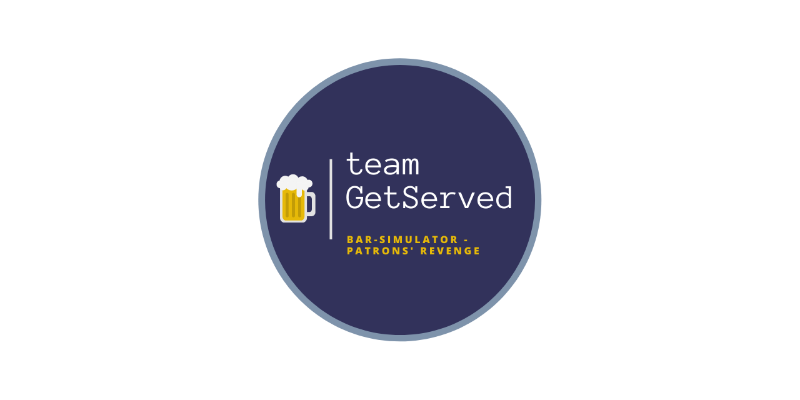
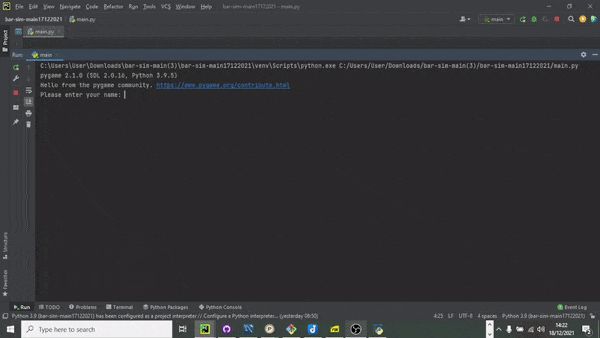

# Get Served

<!-- TABLE OF CONTENTS -->
<details open="open">
    <summary><h2 style="display: inline-block">Table of Contents</h2></summary>
    <ol>
        <li><a href="#documentation">Documentation</a></li>
        <li>
            <a href="#about-the-project">About The Project</a>
            <ul>
                <li><a href="#aims-and-objectives">Aims and Objectives</a></li>
            </ul>
        </li>
        <li>
            <a href="#getting-started">Getting Started</a>
            <ul>
                <li><a href="#prerequisites">Prerequisites</a></li>
                <li><a href="#set-up">Set Up</a></li>
            </ul>
        </li>
        <li>
            <a href="#how-to-use">How To Use</a>
            <ul>
                <li><a href="#running-the-game">Running The Game</a></li>
                <li><a href="#rules-and-mechanics">Rules And Mechanics</a></li>
            </ul>
        </li>
        <li>
            <a href="#demo">Demo</a>
        </li>
        <li><a href="#testing">Testing</a></li>
        <li><a href="#authors">Authors</a></li>
        <li><a href="#acknowledgements">Acknowledgements</a></li>
    </ol>
</details>

## Documentation

[Project Report - Google Docs](https://docs.google.com/document/d/1_87s56uj6fk9VwKWbEPmRjN2gEk3J3xHTOWokUOifYo/edit?usp=sharing)

[Project Presentation - Google Docs (DRAFT)](https://docs.google.com/presentation/d/1OXWSzu-RpkQF6GcSwaCjd8X5_4D7Qk40UPa648saMWA/edit?usp=sharing)

## About the project

### Aims and Objectives

Really fun game, check out our project report for more details.

## Getting started

### Prerequisites

To run this program locally you need to have the following installed/setup:

- Python v3.9 or above
- API key for superheroAPI (please see API Reference below) - [Click Here For Link](https://superheroapi.com/)
- MySQL Database - [Link to SQL query to set up database]((https://github.com/louannl/bar-sim/blob/main/save/game_database.sql))
- A really swanky looking terminal to increase the viewing experience

### Set Up

1.  Clone the repo.
2.  Setup a MySQL database, the information to create the DB is in an SQL file under the 'save' directory.
3.  Install dependencies by using *requirements.txt*, this can be done using the following command:

    *If using a virtual environment set it up first, then install the requirements.txt.
    ```
    pip install -r requirements.txt`
    ```
4.  Copy the `.env.example` file and rename it to `.env` within the *same* directory.
5.  Fill in the `.env` information with your own API keys and DB details.

## How To Use

### Running the game
To run the game, run the following command from the root directory:
```
python -m main
```

### Rules and mechanics

The aim of the game is to keep/get as many 'pints' as possible while navigating through perilous scenes which constantly change. Your play-through at the end will be recorded in a database and a score board will be rendered at the end.

Mechanics:

- Go Home - sometimes you'll get an option to 'reset' however, your score will be carried over and you will be penalised.
- Events - some events will depend on your character, choices or just pure luck, these can affect your point score too - so choose wisely!
- Death *cough*, I mean Tee-total - If you lose too many 'pints' you'll become sober for life and enjoy a long and fruitful life (but, yeah, you lose mate).

## Demo



## Testing

*To run all unit tests, the tests directory needs to have an empty `__init__.py` file.*
To run automated unit tests, run the following command in the root directory:
```
python -m unittest
```
Specific modules can be specified by appending the file path of the test. See unittest documentation for more information e.g.
```
python -m unittest tests/unit/util/test_dice_decider.py
```

## Authors

- [@chloehooper](https://github.com/chloeh98)
- [@louannloizou](https://github.com/louannl)
- [@nuranozan](https://github.com/nuran-o)
- [@zoethomas](https://github.com/zoerthomas)
- [@sunithawebster](https://github.com/SunithaWebster)
  
## Acknowledgements

- [Beer Pouring Animation - Original MP4 Video source](https://pixabay.com/videos/beer-glass-pouring-drink-bar-pub-67395/)
- [Attribution Credit - Breakdown Pictures](https://pixabay.com/users/breakdownpictures-12141240/?utm_source=link-attribution&utm_medium=referral&utm_campaign=image&utm_content=67395)